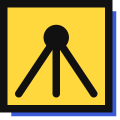
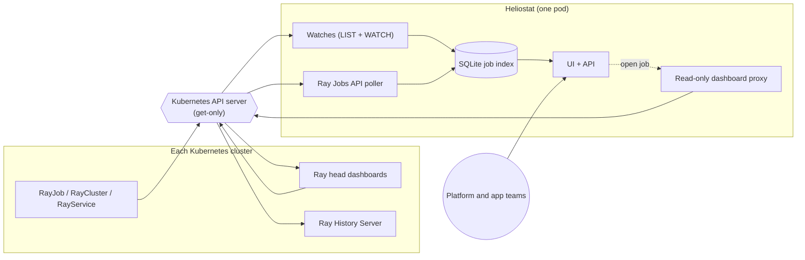

<p align="center">
  
</p>

<h1 align="center">Heliostat</h1>

<p align="center"><b>Every Ray workload, wherever it runs.</b><br>
A read-only console for Ray jobs, Ray clusters, and Ray Serve endpoints across Kubernetes clusters, regions, and accounts.</p>

> [!WARNING]
> **Experimental. Not production ready. For development and evaluation only.** Heliostat has no authentication yet: anyone who can reach the UI can see every job and its Ray logs. Keep it on a `ClusterIP` service behind `kubectl port-forward`, or an internal load balancer on a trusted network.

A heliostat is a field of mirrors that steers many rays of sunlight onto a single target. Heliostat does the same for Ray: every Ray cluster, in every Kubernetes cluster, in one view.

https://github.com/user-attachments/assets/b3eac7d9-4dab-4f35-abe0-4af32aeec29b

- **Jobs**: every `RayJob`, plus every job submitted straight to a Ray cluster with `ray job submit`, the Jobs SDK, or a notebook. Covers training, batch inference, online inference, and data processing, with status, failure reason, runtime, and GPUs.
- **Deep links**: each job opens its live **Ray Dashboard** while its cluster runs, then its **Ray History Server** archive after the cluster is deleted.
- **Clusters and endpoints**: every live `RayCluster` and `RayService`, labelled with the Kubernetes cluster and region they run in.
- **Many clusters**: Amazon EKS clusters in any region or AWS account, and on-premises Kubernetes, all from one install.
- **Read-only by construction**: Heliostat cannot create, change, scale, or stop anything. See [Security](#security).

## How it works



Heliostat watches KubeRay resources and polls each Ray head for jobs submitted outside KubeRay. It keeps every job in a small SQLite index, so finished jobs stay visible after KubeRay deletes them. All Ray traffic goes through the Kubernetes API server with a read-only identity. See [docs/ARCHITECTURE.md](docs/ARCHITECTURE.md).

## Quick start

Requirements: a Kubernetes cluster with [KubeRay](https://github.com/ray-project/kuberay), `helm`, `kubectl`, Docker with buildx, and a container registry your cluster can pull from.

**1. Build the image and push it to your registry**

Heliostat has no published image: you build it from this repository and push it to your own registry (Amazon ECR, Docker Hub, GHCR, Harbor, …).

```bash
make image-push IMAGE=<registry>/heliostat:0.1.0   # multi-arch (amd64 + arm64), about 13 MB
```

For example, with Amazon ECR:

```bash
aws ecr create-repository --repository-name heliostat
aws ecr get-login-password | docker login --username AWS --password-stdin <account>.dkr.ecr.<region>.amazonaws.com
make image-push IMAGE=<account>.dkr.ecr.<region>.amazonaws.com/heliostat:0.1.0
```

Without `make`: `docker buildx build --platform linux/amd64,linux/arm64 -t <registry>/heliostat:0.1.0 --push .`

**2. Install**

```bash
helm upgrade --install heliostat ./charts/heliostat \
  --namespace heliostat --create-namespace \
  --set image.repository=<registry>/heliostat \
  --set image.tag=0.1.0
```

**3. Open it**

```bash
kubectl -n heliostat port-forward svc/heliostat-heliostat 8080:80
```

Visit http://127.0.0.1:8080.

**4. Verify**

- `http://127.0.0.1:8080/api/health` shows every source with `"synced": true`.
- **Jobs** lists your RayJobs. **Dashboard ↗** on a running job opens its Ray Dashboard, through the same port-forward.
- Optional: with the [KubeRay History Server](https://docs.ray.io/en/latest/cluster/kubernetes/user-guides/observability.html) installed, add it to the cluster entry ([docs/CLUSTERS.md](docs/CLUSTERS.md#the-cluster-heliostat-runs-in)). Jobs whose cluster was deleted then show **History ↗**.

`experiments/` has CPU-only RayJobs and a standalone Ray cluster for trying every path on a real cluster at almost no cost.

## Add clusters

Heliostat shows workloads from exactly the Kubernetes clusters listed in its `clusters` configuration (by default, just the cluster it runs in). Add Amazon EKS clusters in any region or AWS account (EKS Pod Identity, no static credentials), or on-premises clusters through a mounted kubeconfig Secret. The configuration holds no credentials.

**→ [docs/CLUSTERS.md](docs/CLUSTERS.md)**

## Security

Heliostat is read-only by construction: even a compromised Heliostat cannot submit, stop, or scale Ray work. Kubernetes RBAC, a get-only API server proxy, and an egress NetworkPolicy each enforce this independently, and it was attack-tested on a live cluster. The egress layer needs a CNI that enforces NetworkPolicy.

**→ [docs/SECURITY-MODEL.md](docs/SECURITY-MODEL.md)**. To report a vulnerability, see [SECURITY.md](SECURITY.md).

## Develop

One Go binary (client-go informers, SQLite, the JSON API, and the dashboard proxy) with a Next.js UI embedded as static files.

```bash
make run      # backend on :8080 against your current kubeconfig
make ui-dev   # UI with hot reload on :3000
make verify   # everything CI runs
```

**→ [docs/DEVELOPMENT.md](docs/DEVELOPMENT.md)**

## Documentation

| Guide | What's in it |
|---|---|
| [Adding clusters](docs/CLUSTERS.md) | Configuration, EKS across regions and accounts, on-premises clusters, what the configuration may and may not contain |
| [Security model](docs/SECURITY-MODEL.md) | The read-only layers, verified attack results, operator checklist, known limitations |
| [Architecture](docs/ARCHITECTURE.md) | Design decisions: one job model, deep links, the proxy, durability, load |
| [Development guide](docs/DEVELOPMENT.md) | How it's built, workflows, testing, common changes, releasing |
| [Roadmap](docs/ROADMAP.md) | What's done and what's next |
| [AGENTS.md](AGENTS.md) | Engineering guide for contributors and coding agents |

## Contributing

Contributions are welcome, from people and from AI coding agents: Claude, GPT, and friends are all welcome 🙂

1. Read [AGENTS.md](AGENTS.md). It explains the architecture, invariants, and conventions, and coding agents should load it first.
2. [Open an issue](../../issues/new/choose) describing the bug or proposal, and wait for a maintainer to approve the approach.
3. Open a pull request linked to the issue, with `make verify` passing.

**Help wanted: authentication and multi-tenancy.** We would love contributions of OIDC sign-in, per-team namespace scoping, and a separate origin for the dashboard proxy. See [docs/SECURITY-MODEL.md](docs/SECURITY-MODEL.md#help-wanted) and [CONTRIBUTING.md](CONTRIBUTING.md).

## License

[Apache License 2.0](LICENSE). Heliostat is an independent project and is not affiliated with the Ray project or Anyscale. See [NOTICE](NOTICE).

---

<p align="center">Built by <a href="https://github.com/vara-bonthu">Vara Bonthu</a> with AI coding tools.</p>
