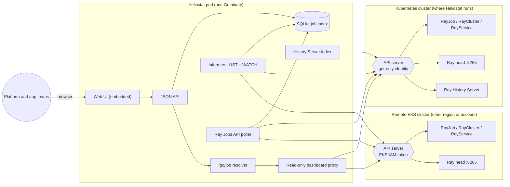

# Architecture

Heliostat is one Go binary: collectors, a SQLite job index, the JSON API, a read-only Ray Dashboard proxy, and the web UI (embedded static files).

Every arrow into a cluster goes through that cluster's API server with a read-only identity. Heliostat never talks to Ray pods directly (see [SECURITY-MODEL.md](SECURITY-MODEL.md)).

## Design decisions

### One Go binary with an embedded UI

The backend is Go because this is Kubernetes-native software. client-go's shared informers handle LIST, WATCH, relists, and missed deletions the same way Kubernetes controllers do. The AWS SDK signs EKS tokens. Pure-Go SQLite keeps the binary static, with no cgo.

The UI is Next.js and React, exported as static files and compiled into the binary with `go:embed`. At runtime there is one process, one container (about 13 MB, distroless), and no Node.js. The browser only talks to Heliostat's JSON API; `internal/domain/types.go` and `ui/lib/domain/types.ts` define that contract.

### One job model for every submission path

Teams launch Ray work in several ways, and only one of them creates a Kubernetes object:

| Path | Visible as | Source |
|---|---|---|
| `kubectl apply` a RayJob, or a GitOps controller | `RayJob` | Kubernetes watch |
| `ray job submit` / Jobs SDK to an existing cluster | `Submission` | Ray head `GET /api/jobs/` |
| `ray.init()` from a notebook or pod | `Driver` | Ray head `GET /api/jobs/` |

All three are normalized to the same `JobRecord`, so status filters, search, and links behave identically. A RayJob's own submission appears on its head too. Heliostat matches it by submission ID and merges it into the RayJob record instead of duplicating it. That match is also how Heliostat learns Ray's hex job ID, which the History Server needs.

### Status precedence

A RayJob has two statuses: KubeRay's `jobDeploymentStatus` and Ray's `jobStatus`. The deployment status wins for terminal and suspended states. A job killed by `activeDeadlineSeconds`, or whose submitter pod failed, is `Failed` in KubeRay while Ray may still report `RUNNING`, or nothing. The full mapping is table-tested in `internal/domain/domain_test.go`.

### Why links go through Heliostat

KubeRay publishes `status.dashboardURL` as an in-cluster address (`<head-svc>.<ns>.svc.cluster.local:8265`) that browsers cannot reach. Exposing every Ray head separately would mean one load balancer per cluster, each with the full Ray Jobs API (including job submission) open to whoever can reach it.

Instead, Heliostat serves each dashboard under `/ray/live/<cluster>/<ns>/<name>/`:

- **Links always work.** They work wherever Heliostat is reachable (port-forward, internal load balancer), for live and deleted clusters alike.
- **Read-only enforcement lives in one place.** GET and HEAD only, plus a denylist of Ray GET routes that attach profilers to workers or download user code.
- **No arbitrary targets.** The proxy reaches only Ray clusters Heliostat currently observes, so it cannot be used to browse other services.

The Ray History Server's dashboard picks an archived session from cookies set by an interactive `/enter_cluster` call. Those cookies expire after 10 minutes. Heliostat puts the session in the URL path and sends the cookies itself on every request. History links are therefore stable, shareable, and never expire. Selecting a session is not enough to load it. The History Server keeps sessions in a memory cache and returns 503 for any it has not loaded or has evicted. Heliostat therefore loads the session with `/enter_cluster` before proxying, and reloads and retries once on a 503.

### Reaching services through the API server

By default every call to a Ray head or the History Server goes through the Kubernetes API server's service proxy, even inside Heliostat's own cluster. Heliostat's identity has only `get` on `services/proxy`, so the API server refuses any `POST`, `PUT`, or `DELETE`: a compromised Heliostat cannot submit or stop Ray jobs. The chart's egress NetworkPolicy then limits the pod to TCP 443 and DNS, closing the direct network path to Ray's unauthenticated ports. The same path works for remote clusters, since it needs only the API server to be reachable, not pod networks. `serviceTransport: direct` trades these guarantees for lower latency and is opt-in.

### Durability without an operator

Kubernetes cannot return a deleted object, and KubeRay deletes RayJobs after `ttlSecondsAfterFinished`. Heliostat therefore records every job the moment it sees it and updates it on every change. The informers relist after watch gaps and emit deletions for anything that vanished meanwhile. After the first sync on startup, Heliostat reconciles its records against the live objects, so deletions that happened while it was down are closed too.

SQLite keeps the footprint to one pod and one small volume. The price is a single replica: the chart pins `replicas: 1` with a `Recreate` strategy so two pods never contend for the ReadWriteOnce volume.

### Why readiness ignores Kubernetes

A single unreachable cluster, especially a remote one, must not take the console out of service for everyone. `/api/readyz` checks only that the database is usable. Per-source collector health is returned by `/api/health`, and the UI shows a banner when any source is failing.

### Load on the API servers and Ray

- **Kubernetes:** one LIST and one WATCH per resource type per cluster. Browser traffic never reaches Kubernetes, except when someone opens a Ray dashboard through the proxy.
- **Ray heads:** one small `GET /api/jobs/` per ready head every 30 seconds, with bounded concurrency.
- **Browsers:** they poll Heliostat with ETags, so an unchanged view costs a `304`. Polling pauses in hidden tabs.

## Data retention

Job records store metadata only: status, timestamps, a truncated failure message, and a truncated entrypoint. Logs, inputs, and outputs stay in Ray, the History Server's object store, and your own storage. Records are deleted `retention.days` after their backing object disappears.
